# ☕ Cafeteria Carioca na AWS Cloud

Portfolio_Proj_018-Cafeteria_Carioca_na_AWS_Cloud

Projeto acadêmico com foco em **Cloud Computing**, demonstrando a hospedagem de um site institucional estático na AWS e a exploração de serviços fundamentais da nuvem, usando como estudo de caso o site da **Cafeteria Carioca**.

---

## 🌐 Site publicado (versão permanente)

Como os ambientes de laboratório da AWS são temporários, o site da **Cafeteria Carioca** também está disponível em uma versão permanente publicada via **GitHub Pages**.

🔗 **Site online (GitHub Pages):**
[https://marcia-moreira.github.io/Portfolio_Proj_010-Site_Cafeteria_Carioca/]

🔗 **Repositório do front-end (código-fonte):**
[https://github.com/Marcia-Moreira/Portfolio_Proj_010-Site_Cafeteria_Carioca]

> Esta versão permanente representa o mesmo site utilizado nos laboratórios da AWS (Amazon S3 – Static Website Hosting).
>
> Este repositório tem como objetivo **documentar o uso de serviços da AWS em ambiente de laboratório**, por meio de prints, evidências e explicações técnicas, não sendo responsável pelo versionamento do código do front-end.

---

## 📌 Visão geral do projeto

O objetivo deste projeto é demonstrar, de forma prática e conceitual, como uma aplicação simples pode ser hospedada e evoluída dentro da AWS.

O projeto está organizado em **fases**, onde cada fase apresenta um serviço ou conceito da AWS que faria parte de uma arquitetura real para um pequeno negócio.

> ⚠️ Observação: devido às limitações do ambiente de laboratório (AWS Academy / VocLabs), alguns recursos não permanecem ativos após o encerramento da sessão. Por isso, o projeto é documentado com prints, vídeos e explicações arquiteturais.

---

## 🟢 Fase 1 — Hospedagem de Site Estático no Amazon S3

### 🎯 Objetivo

Hospedar o site institucional da Cafeteria Carioca de forma simples, escalável e sem necessidade de servidor.

### 🔧 Serviço utilizado

- Amazon S3 (Simple Storage Service)

### 🛠️ O que foi feito

- Criação de um bucket S3
- Upload dos arquivos HTML, CSS, JavaScript e imagens do site
- Ativação do **Static Website Hosting**
- Configuração de permissões públicas de leitura
- Acesso ao site via URL pública do S3

### ✅ Resultado

O site ficou acessível diretamente pelo endpoint de site estático do S3.

### 📸 Evidências

**Bucket S3 criado**

[INSERIR PRINT DO BUCKET AQUI]

  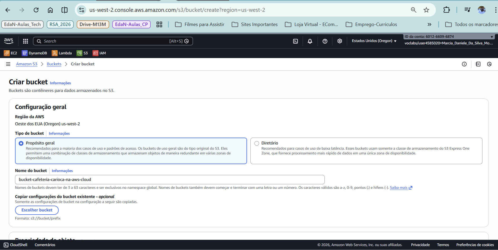
  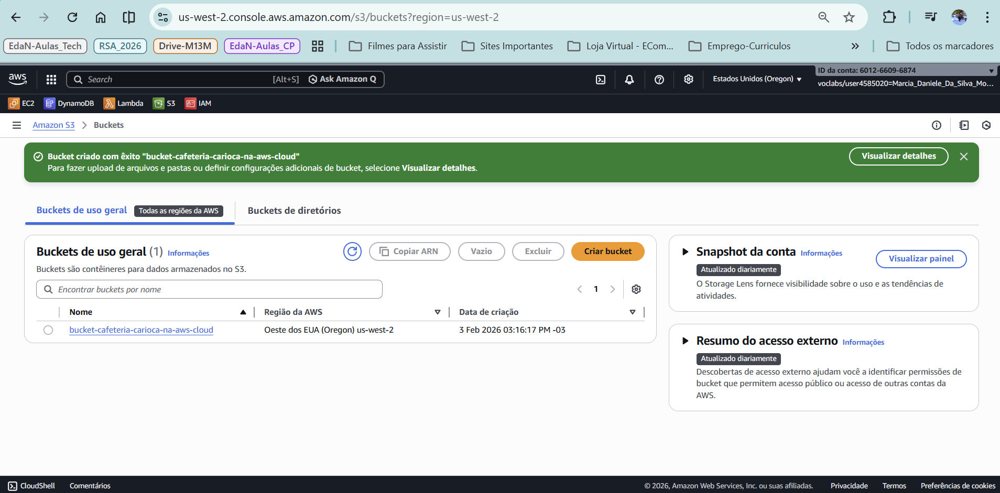

---

  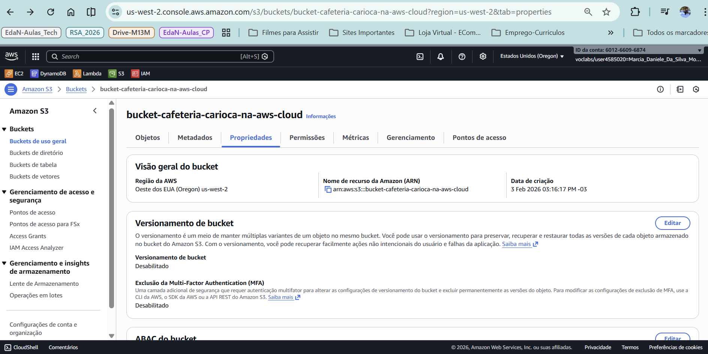
  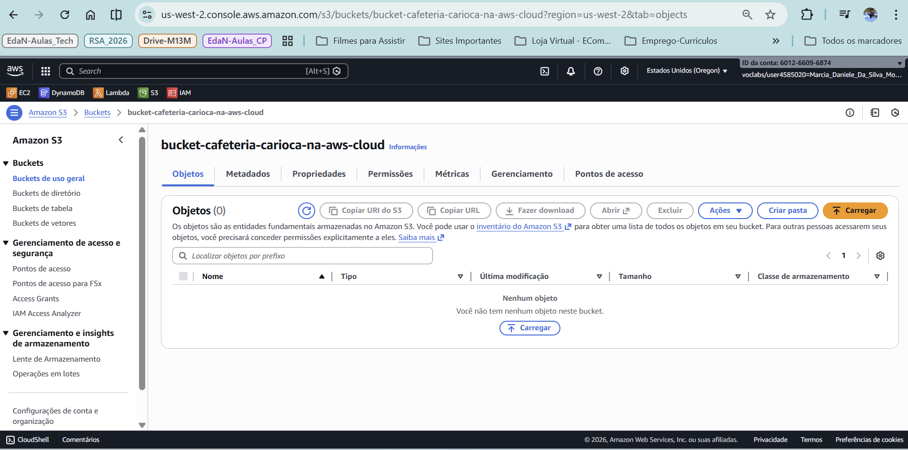

---

  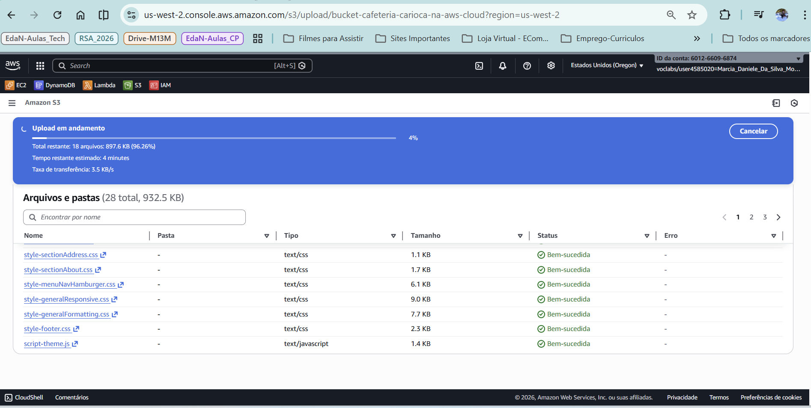
  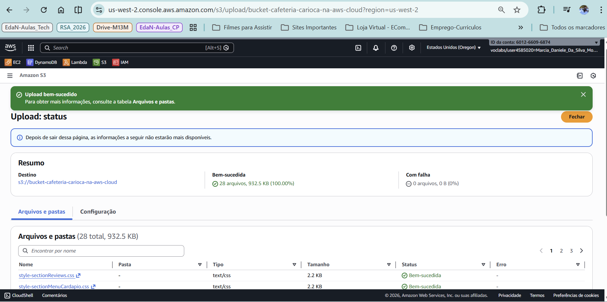

---

  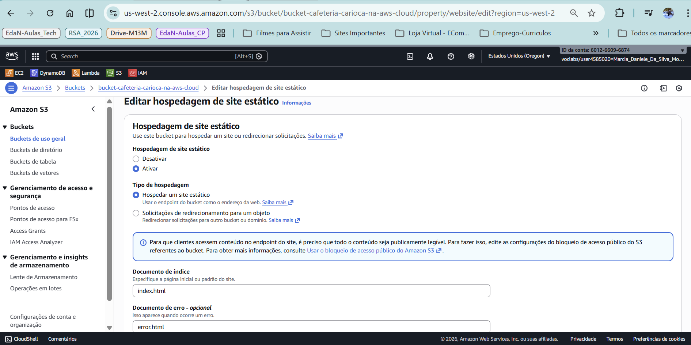
  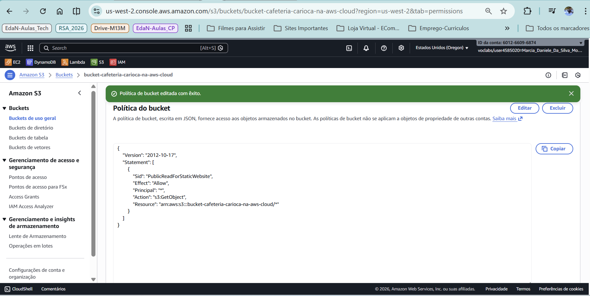
  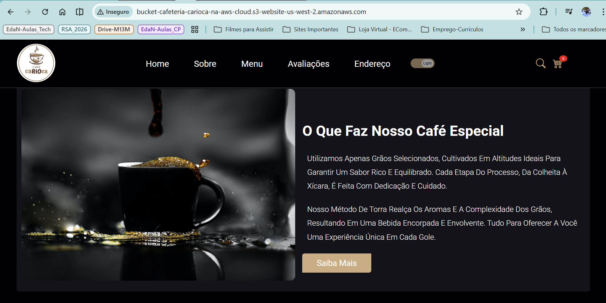

**Configuração de Static Website Hosting**

[INSERIR PRINT DA CONFIGURAÇÃO AQUI]

**Site funcionando via URL do S3**

[INSERIR PRINT DO SITE NO NAVEGADOR]

**Demonstração em vídeo / GIF**

<!-- [INSERIR GIF OU LINK PARA VÍDEO] -->
<!-- 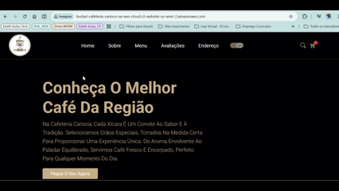 -->

  

---

  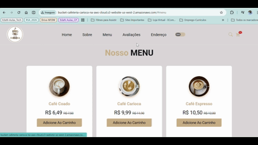

### 💡 Por que usar S3?

- Alta disponibilidade
- Baixo custo
- Escalabilidade automática
- Ideal para sites institucionais e landing pages

---

## 🔵 Fase 2 — Rede e Isolamento com Amazon VPC

### 🎯 Objetivo

Compreender como a AWS organiza recursos dentro de redes privadas e seguras.

### 🔧 Serviço explorado

- Amazon VPC (Virtual Private Cloud)

### 🛠️ O que foi feito

- Criação de uma VPC com nome relacionado ao projeto
- Exploração das configurações de VPC
- Visualização de sub-redes, tabelas de rotas e gateways
- Análise conceitual de isolamento e controle de tráfego

### 🔗 Relação com o projeto

Em um cenário real, a VPC seria utilizada para:

- Hospedar servidores EC2
- Isolar banco de dados
- Controlar tráfego de entrada e saída

### 📸 Evidências

[INSERIR PRINT DA VPC CRIADA]

  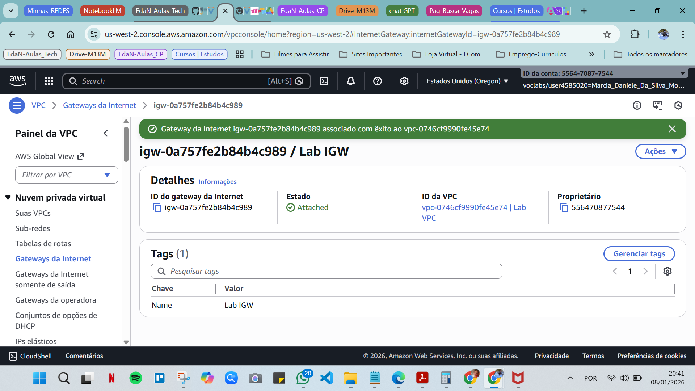
  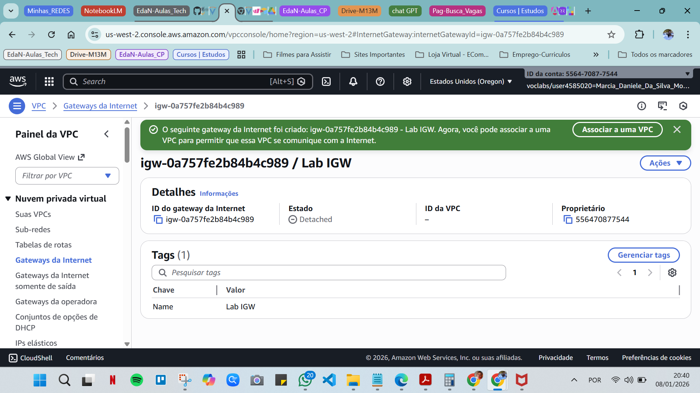

---

## 🔐 Fase 3 — Segurança e Controle de Acesso (IAM)

### 🎯 Objetivo

Entender como a AWS controla acesso a recursos e serviços.

### 🔧 Serviço explorado

- AWS Identity and Access Management (IAM)

### 📘 Conceitos aplicados

- Usuários e permissões
- Políticas de acesso
- Princípio do menor privilégio

### 🔗 Relação com o projeto

No contexto da Cafeteria Carioca:

- Apenas usuários autorizados poderiam alterar o site
- Permissões seriam separadas por função
- Recursos críticos seriam protegidos

### 📸 Evidências

[INSERIR PRINTS DO IAM]

  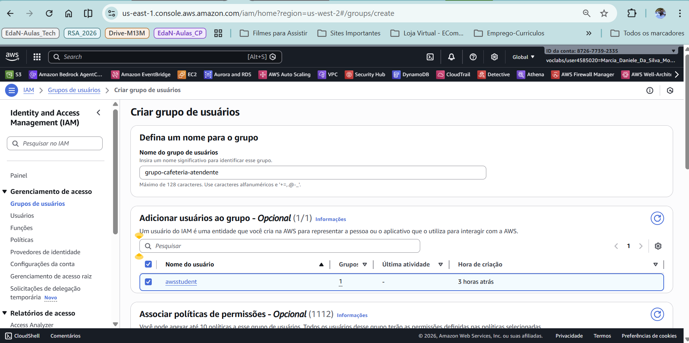
  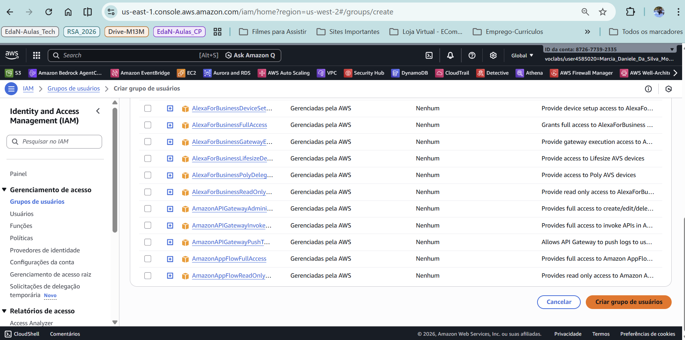

---

## 🟣 Fase 4 — Computação com Amazon EC2

### 🎯 Objetivo

Compreender o conceito de servidores virtuais na AWS e como aplicações podem ser executadas em ambientes computacionais sob demanda.

### 🔧 Serviço explorado

- Amazon EC2 (Elastic Compute Cloud)

### 🛠️ O que foi feito

- Criação de uma instância EC2 com nome relacionado ao projeto
- Análise das opções de configuração da instância
- Visualização do estado de execução da instância
- Exploração do conceito de acesso e gerenciamento da EC2

### 🔗 Relação com o projeto

Em uma evolução do projeto, a instância EC2 poderia ser utilizada para:

- Hospedar um backend dinâmico
- Servir aplicações que não sejam estáticas
- Integrar com banco de dados e outros serviços AWS

### 📸 Evidências

[INSERIR PRINTS DA INSTÂNCIA EC2 CRIADA E EM EXECUÇÃO]

  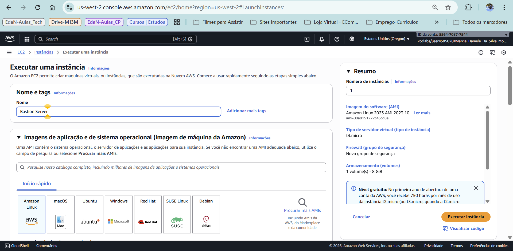
  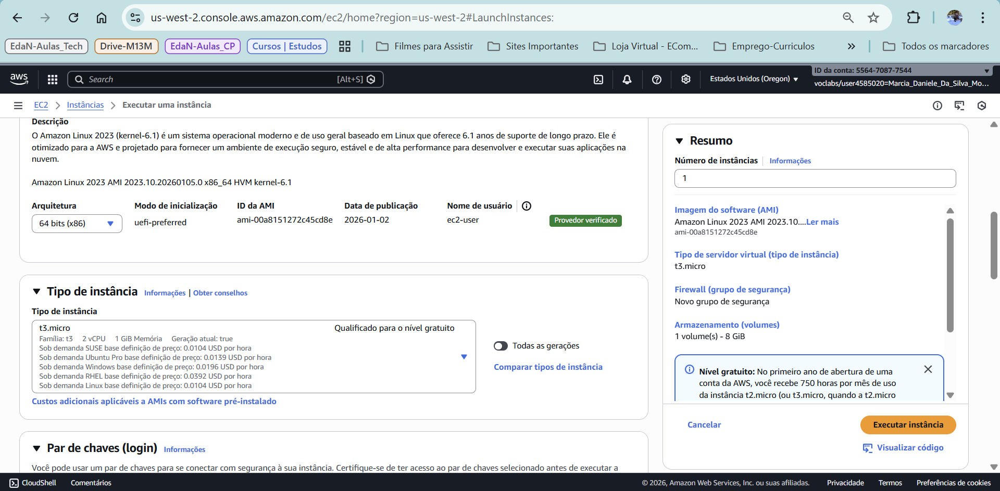
  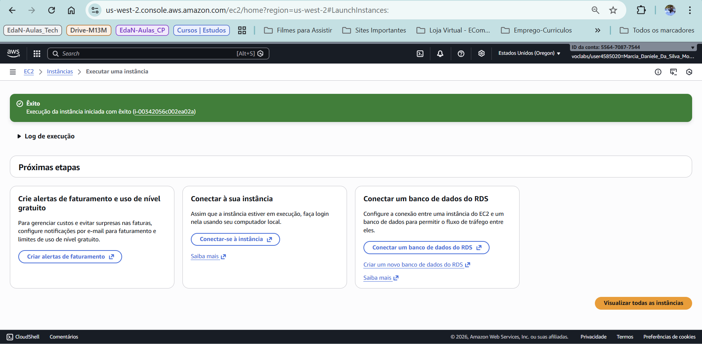

---

## 📊 Fase 5 — Auditoria e Monitoramento (Visão conceitual)

### 🎯 Objetivo

Entender como a AWS oferece mecanismos de auditoria, rastreabilidade e monitoramento de recursos e ações executadas no ambiente.

### 🔧 Serviços explorados

- AWS CloudTrail (auditoria)
- Amazon CloudWatch (monitoramento)

### 📘 Conceitos abordados

- Registro de ações realizadas na conta AWS
- Auditoria de acessos e alterações em recursos
- Monitoramento de métricas e eventos
- Importância da observabilidade em ambientes de produção

> ⚠️ Observação: devido às restrições do ambiente de laboratório, alguns recursos do CloudWatch não puderam ser utilizados plenamente. Ainda assim, o serviço foi explorado de forma conceitual.

### 📸 Evidências

[INSERIR PRINTS DO CLOUDTRAIL E VISUALIZAÇÃO DO CLOUDWATCH]

  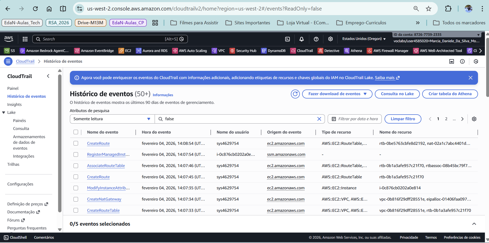
  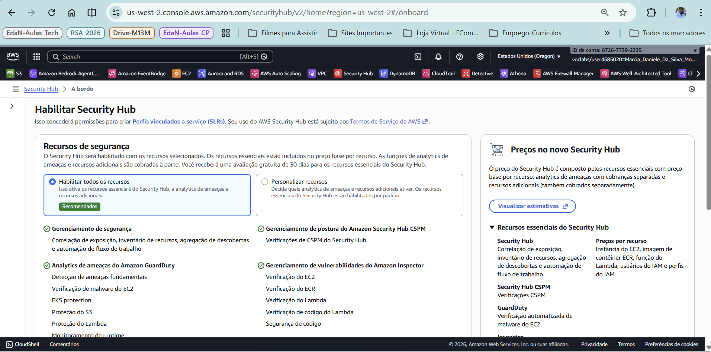

---

## 🧭 Fase 6 — Exploração de Serviços AWS (Explore)

### 🎯 Objetivo

Explorar outros serviços disponíveis na AWS, compreendendo seus propósitos e como poderiam ser utilizados em uma arquitetura real.

### 🔍 Serviços visualizados

- AWS IAM (estrutura de usuários e grupos)
- Amazon RDS e Aurora
- Amazon DynamoDB
- Amazon SageMaker
- Amazon Bedrock
- AWS CloudShell (visualização com restrições)

### 📘 Abordagem

Nesta fase, os serviços foram explorados de forma investigativa e conceitual, com foco em:

- Entender o papel de cada serviço
- Relacionar os serviços com possíveis evoluções do projeto
- Reconhecer limitações do ambiente acadêmico

### 📸 Evidências

[INSERIR PRINTS DE TELAS DE EXPLORAÇÃO DE SERVIÇOS]

  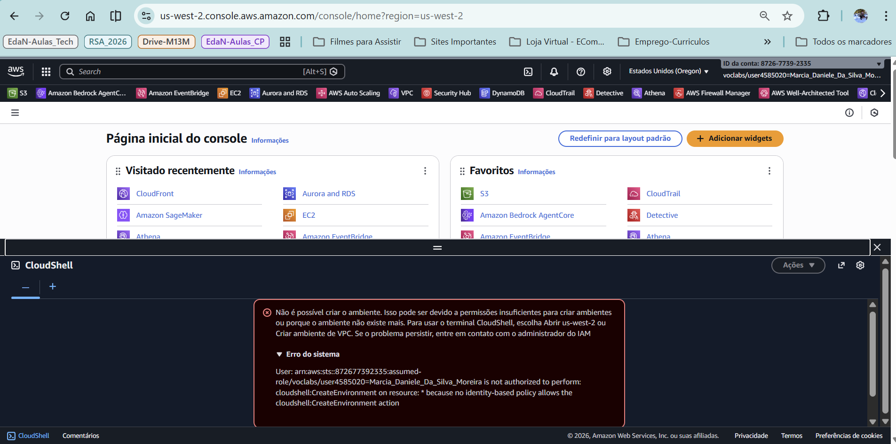
  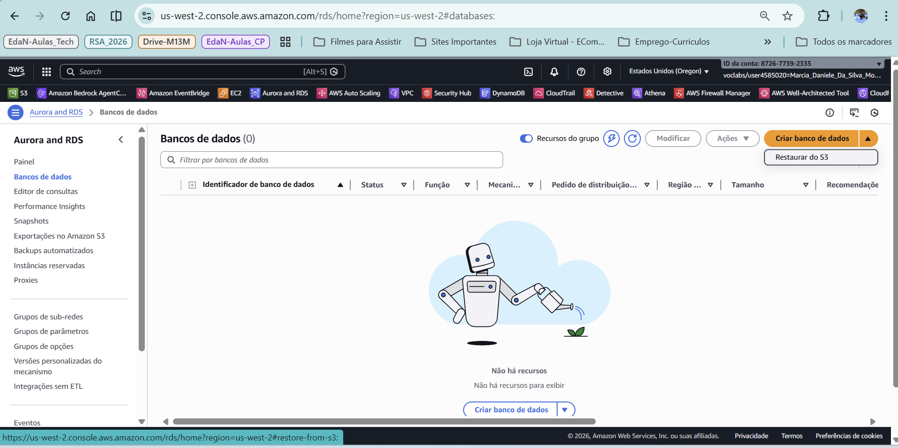

---

  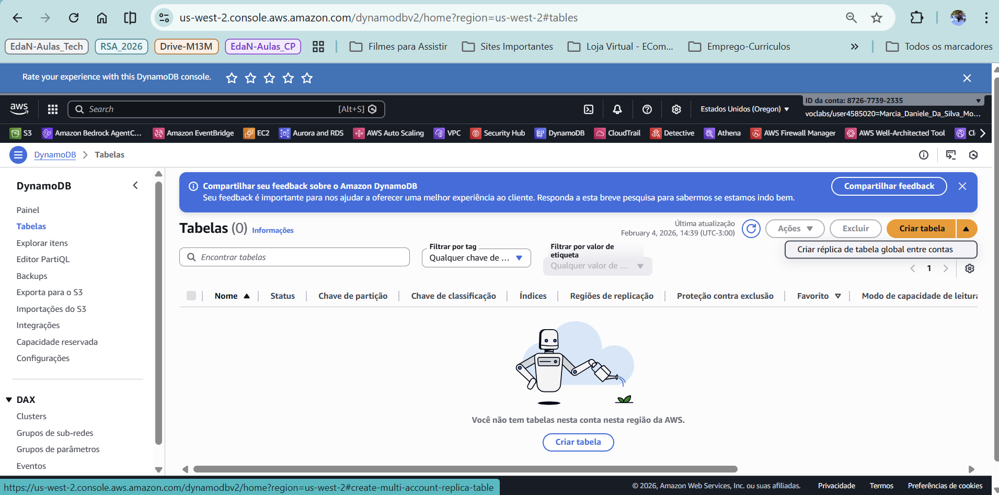
  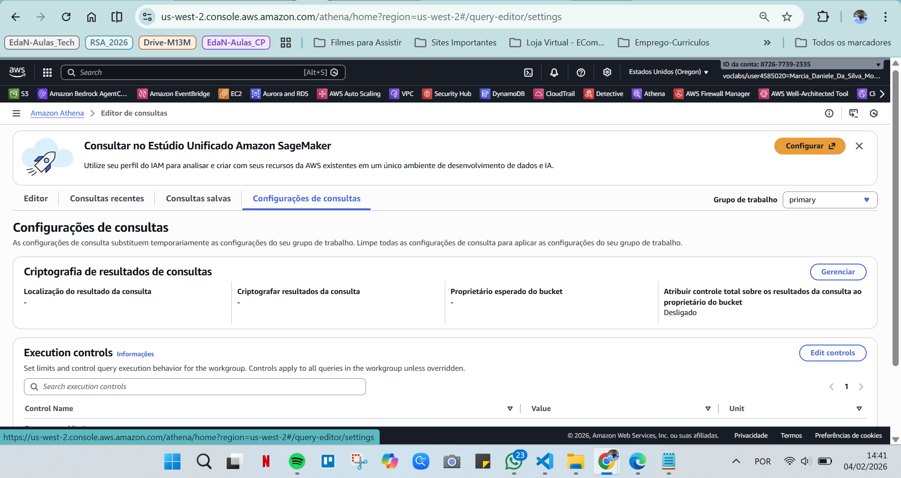
  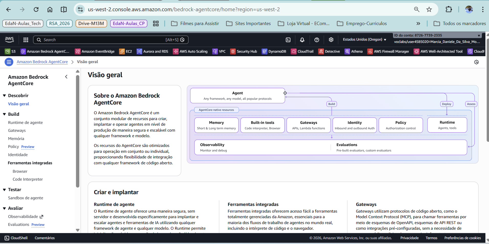

---

## 🚀 Possíveis evoluções do projeto

Este projeto representa uma base conceitual e prática para uma arquitetura em nuvem mais completa. A partir do que foi explorado nos laboratórios, seriam evoluções naturais:

- Amazon EC2 para backend dinâmico da aplicação
- Amazon RDS ou DynamoDB para persistência de dados
- Elastic Load Balancer para alta disponibilidade
- AWS CLI para automação de criação e gerenciamento de recursos
- Amazon CloudFront para distribuição de conteúdo (CDN)

Alguns desses serviços foram visualizados de forma exploratória ou conceitual durante os laboratórios.  
Outros não puderam ser implementados devido às **limitações de tempo, permissões e natureza temporária do ambiente de laboratório**, mas fazem parte da visão arquitetural do projeto.

---

## 📚 Conclusão

O projeto **Cafeteria Carioca na AWS** demonstra:

- Hospedagem eficiente de site estático
- Compreensão de redes e segurança
- Noções de arquitetura em nuvem
- Capacidade de adaptação a ambientes temporários

Mesmo em um contexto acadêmico, o projeto reflete práticas reais de cloud computing.

---

## ✍️ Autora

**Marcia Moreira**  
Desenvolvedora Web  
Projeto desenvolvido para estudos em Cloud Computing / AWS e Escola da Núvem

  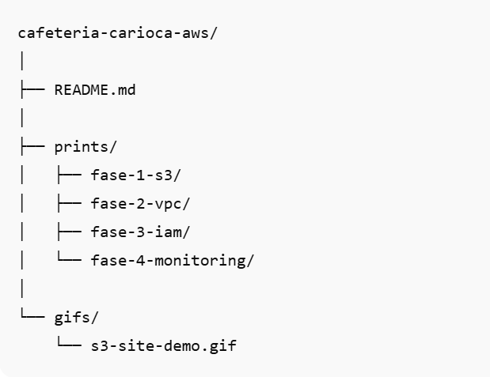

cafeteria-carioca-aws/
│
├── README.md
│
├── prints/
│   ├── fase-1-s3/
│   ├── fase-2-vpc/
│   ├── fase-3-iam/
│   └── fase-4-monitoring/
│
└── gifs/
    └── s3-site-demo.gif

-

--

---
